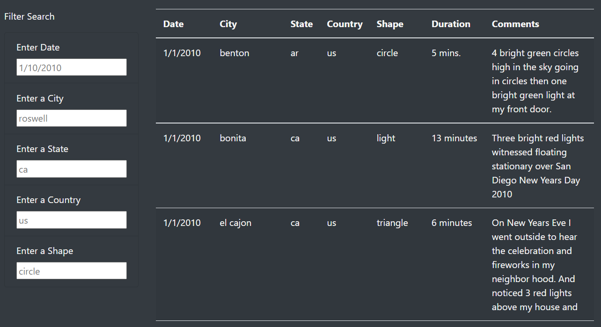

## Overview of the Truth: 
---

As a data journalist, I was given the task to write about my home town of McMinnville, OR, a destination site for UFO enthusiasts across the country. Provided a raw JavaScript file of UFO sighting data, I took to the web to create a webpage about McMinnville and created a tool to search through the extensive UFO sighting data easily.

Tools used to build the webpage:
-   HTML
-   JavaScript
-   Bootstrap

## How to find the Truth
---

To use the webpage's search function, a user need only enter search criteria on the left side of the page and hit enter. Our JS function does all the magic for you to filter the table of UFO sighting info to give you just the sightings that meet the user's search criteria.

### Search criteria available:
-   Date
-   City
-   State
-   Country
-   Shape

## Drawbacks
---

Unfortunately, as exciting of a tool as this is for our local UFO hunter community, this webpage will quickly be out of date as more and more UFO sightings are recorded. Because we used a static dataset to create the table, it will not be easily updated with new UFO sightings.

In an effort to enhance this webpage in the future, I would like to implement a better way to log new UFO sightings. Either a way to log new sightings through the webpage or to pull the table data from a data source that is updated regularly. Another enhancement I would make is to create a way to search by date range in order for users to be able to search for sightings within a certain date range.